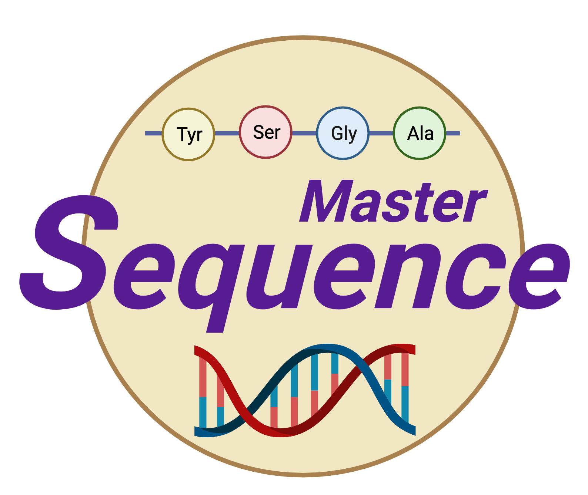
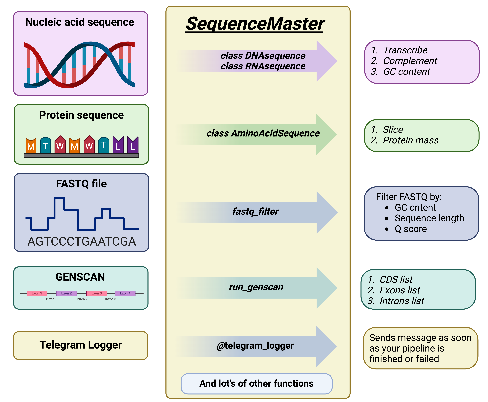

# **SequenceMaster** <a href="">

_A powerful and minimalistic bioinfomatical tool to work with sequences of nucleic acids andproteins and various file formats that are widely used in bioinformatics._

<div style='justify-content: center'>

</div>

<hr style="border:2px solid gray">

This repo represents my implementation of different tools for bioinformatics made during my education at the Bioinformatics Institute. Main educational topics covered: 

<div style='justify-content: center'>

</div>

- Basic Python Decorators OOP Iterators Generators RegEx Visualization Pandas Numpy
- Web scraping Developer tools Parallel programming


## Key Features

- **Nucleic Acid Analysis:** SequenceMaster offers comprehensive tools for analyzing DNA and RNA sequences. 

- **Protein Analysis:** Explore protein sequences with advanced tools for pI calculation, protein mass calculation, 

- **FASTQ File Filtering:** Easily filter FASTQ files depending on quality, sequence length and GC content

- **FASTA File Manipulation:** Convert multiline FASTA to oneline FASTA and shift starting point 

- **GBK Data Extraction:** Extract sequence of your gene of interest and his neighbouring genes

- **GenScan output parsing:** Sends get request with your input file to GenScan and returns the parsed lists of exons, introns and cds

- **Decorator for logging bioinformatical pipelines:** Helps you to stay tuned with progress of your pipeline. It will send you a message, when the pipeline is finished or failed.

## Installation

To get the tool clone the git repository::

```bash
git clone https://github.com/SuleimanovShakir/SequenceMaster.git && cd SequenceMaster
```

## Usage

SequenceMaster consits of 2 independent scripts: sequence_tools and bio_files_processor. 
sequence_tools mostly aimed to work with your sequence as well as filtering data from FASTQ.
bio_files_processor helps you to manipulate with FASTQ and extract data from GBK.

## Usage

Please, see showcases.ipynb to get familiar with the **Sequence Master** implementation.

## Contacts 
Shakir Suleimanov,\
Please, do not hesitate to contact me via [Git-Hub](https://github.com/SuleimanovShakir) or [e-mail](suleymanovef@gmail.com).